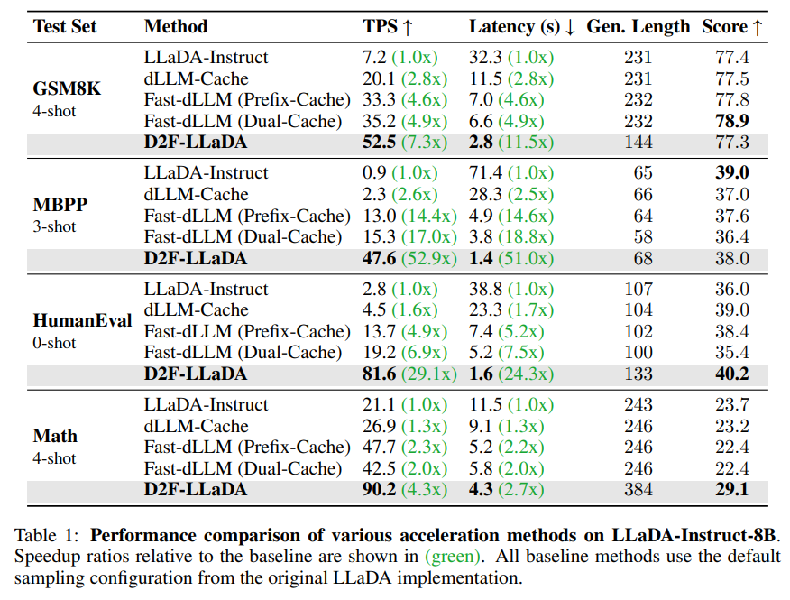

# ⚡ D2F: Diffusion LLMs Can Do Faster-Than-AR Inference via Discrete Diffusion Forcing

<p align="center">
  <a href="https://arxiv.org/abs/2409.11718"><b>📄 Paper</b></a> •
  <a href="https://zhijie-group.github.io/Discrete-Diffusion-Forcing/"><b>📝 Blog Post</b></a>
</p>

<p align="center">
  <a href="https://huggingface.co/SJTU-Deng-Lab/D2F_Dream_Base_7B_Lora"><b>🤗 D2F-Dream LoRA</b></a> •
  <a href="https://huggingface.co/SJTU-Deng-Lab/D2F_LLaDA_Instruct_8B_Lora"><b>🤗 D2F-LLaDA LoRA</b></a>
</p>

<p align="center">
    
    <br>
    <small><b>Inference throughput comparison:</b> D2F dLLMs surpass similarly-sized AR models in inference speed for the first time, achieving up to a <b>2.5x speedup</b> over LLaMA3 and a <b>>50x speedup</b> over vanilla dLLM baselines.</small>
</p>

<p align="center">
  <video width="95%" autoplay loop muted playsinline>
    <source src="docs/assets/video/d2f_vs_ar_demo.mp4" type="video/mp4">
  </video>
  <br>
  <small><b>Real-time generation demo:</b> our D2F model (left) uses parallel block decoding, while the AR baseline (right) generates tokens sequentially. This visualizes the source of D2F's significant throughput advantage.</small>
</p>

**Discrete Diffusion Forcing (D2F)** is a novel training and inference paradigm that, for the first time, enables open-source Diffusion Language Models (dLLMs) to surpass their autoregressive (AR) counterparts in inference speed. By introducing a highly efficient AR-diffusion hybrid model, D2F achieves:
- Up to a **2.5x speedup** over leading AR models like LLaMA3-8B.
- A staggering **50x acceleration** over vanilla dLLM baselines.
- Comparable generation quality on standard reasoning and coding benchmarks.

This repository provides the code to reproduce our evaluation results and run generation demos.

## 🔥 News!
* Aug 8, 2025: We've released the inference code and training pipeline of D2F!
## Contents
- [🤔 How It Works](#-how-it-works)
- [📊 Performance Highlights](#-performance-highlights)
- [🚀 Usage Guide](#-usage-guide)
- [🙏 Acknowledgements](#-acknowledgements)
- [©️ Citation](#️-citation)

## 🤔 How It Works

D2F overcomes the historical speed bottlenecks of dLLMs (KV Cache incompatibility and strict sequential dependencies) by restructuring the generation process.

**1. Hybrid Architecture:** D2F employs a **block-wise causal attention** mechanism. Attention *within* a block is bidirectional, preserving rich local context, while attention *between* blocks is causal. This simple but powerful change makes the model fully compatible with the standard KV Cache, drastically reducing redundant computations.

**2. Efficient Training via Asymmetric Distillation:** Instead of training from scratch, we distill a powerful, pre-trained bidirectional dLLM (teacher) into our cache-friendly D2F model (student). The student learns to match the teacher's output with only a limited, causal view of the context.

<p align="center">
    
    <br>
    <small><b>Overview of Discrete Diffusion Forcing (D2F):</b> A D2F model (student) with a KV-cache-friendly block-wise causal attention mask is trained to mimic a powerful, pre-trained bidirectional dLLM (teacher), efficiently inheriting its capabilities.</small>
</p>

**3. High-Throughput Pipelined Decoding:** D2F is trained to predict future blocks based on *partially incomplete* prefixes. This enables a **pipelined parallel decoding** algorithm during inference, where multiple blocks are refined simultaneously in an asynchronous workflow, maximizing GPU utilization and throughput.

<p align="center">
    
    <br>
    <small><b>Visualization of our pipelined parallel decoding:</b> New blocks are dynamically added and decoded in parallel with their predecessors, moving from a conservative "semi-activated" state to an aggressive "fully-activated" state. This creates a continuous, high-throughput generation flow.</small>
</p>

## 📊 Performance Highlights

We applied D2F to two popular open-source dLLMs: **LLaDA-Instruct-8B** and **Dream-Base-7B**. The results demonstrate massive speedups over baselines and previous SOTA acceleration methods, without compromising on quality.

#### Performance on LLaDA-Instruct-8B
<p align="center">
    
    <br>
    <small>D2F provides transformative speedups for LLaDA-Instruct-8B, achieving a <b>52.9x</b> increase in throughput on MBPP and a <b>29.1x</b> increase on HumanEval while also improving the score.</small>
</p>

#### Performance on Dream-Base-7B
<p align="center">
    
    <br>
    <small>Applying D2F to Dream-Base-7B results in substantial gains, including a <b>9.6x</b> speedup on GSM8K-CoT and a <b>10.1x</b> speedup on MBPP. Notably, performance scores often improve alongside the acceleration.</small>
</p>

## 🚀 Usage Guide

### 1. Installation

First, clone the repository and set up the environment.

```bash
# Clone the repository
git clone https://github.com/zhijie-group/Discrete-Diffusion-Forcing.git
cd Discrete-Diffusion-Forcing

# Create and activate a conda environment
conda create -n d2f python=3.10
conda activate d2f

# Install dependencies
pip install -r requirements.txt
```

### 2. Evaluation
All evaluation scripts are located in the `D2F-eval` directory.

```bash
cd D2F-eval
```
To evaluate the **D2F-Dream** model on all benchmarks, run:
```bash
bash eval_dream.sh
```

To evaluate the **D2F-LLaDA** model on all benchmarks, run:
```bash
bash eval_llada.sh
```
The results will be saved in the `output_path` specified within the shell scripts.

> ### ❗️ Important Notice for HumanEval
> The `HumanEval` benchmark requires a post-processing step to sanitize the generated code and calculate the final `pass@1` score. After the evaluation script finishes, run the following command:
> ```bash
> python postprocess_code.py {path/to/your/samples_humaneval_xxx.jsonl}
> ```
> Replace the path with the actual path to your generated samples file, which can be found in the specified `output_path`.

### 3. Generation Demo

We provide simple scripts to demonstrate the generation process and compare D2F with a standard AR baseline.
```bash
# To run a demo with the baseline AR generation method:
python generate_llada_demo_ar.py

# To run a demo with the D2F pipelined block generation method:
python generate_llada_demo_block.py
```
You can inspect these files to see how to use the D2F model for inference in your own projects.

## 📚 Todo List
- [ ] Add support for vllm


## 🙏 Acknowledgements
Our work builds upon the foundations laid by the original **LLaDA** and **Dream** models. We thank their authors for making their work public. We are also grateful for the powerful open-source tools from Hugging Face that made this research possible.


## ©️ Citation
If you find our work useful for your research, please consider citing our paper:
```bibtex
@article{wang2025d2f,
  title={Diffusion LLMs Can Do Faster-Than-AR Inference via Discrete Diffusion Forcing},
  author={Wang, Xu and Xu, Chenkai and Jin, Yijie and Jin, Jiachun and Hu, Yanzhe and Deng, Zhijie},
  journal={arXiv preprint arXiv:2409.11718},
  year={2024}
}
```
